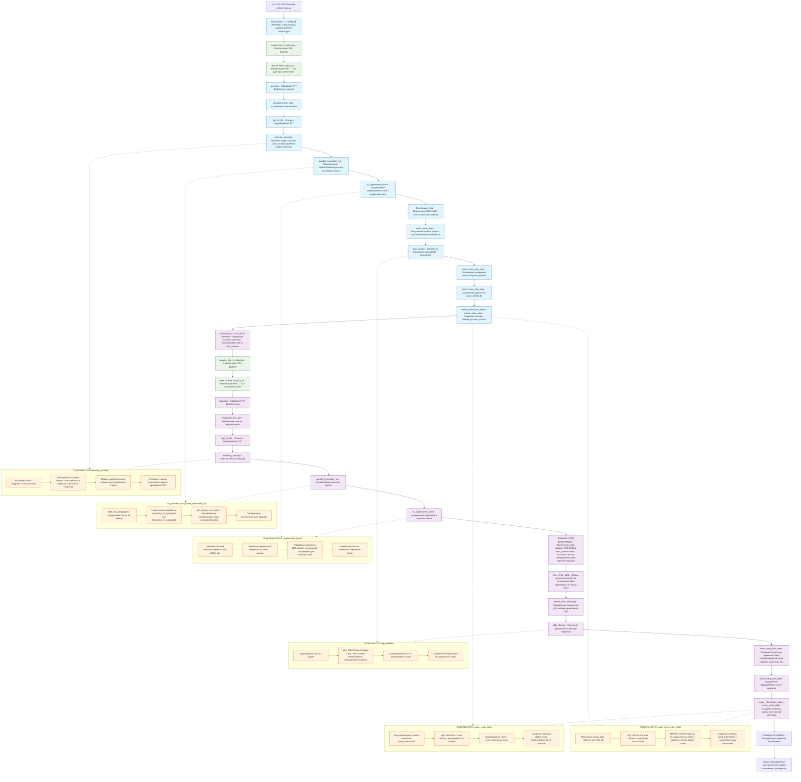

# Подробная блок-схема проекта English Project

Эта диаграмма показывает полный жизненный цикл проекта с правильной логикой двух запусков и деталями каждого этапа.

## Описание блок-схемы

### Основной поток выполнения:

1. **main.py** → Запуск программы с двумя проходами
2. **rename_files_in_directory** (file_processing.py) → Очистка имен PDF файлов
3. **Цикл os.walk** → Поиск всех PDF файлов
4. **pdf_to_txt** (file_processing.py) → Конвертация PDF в TXT с помощью poppler-utils
5. **reqursion** (main.py) → Рекурсивная обработка всех TXT файлов
6. **analysand_func_dict** (text_analysis.py) → Извлечение слов из книги
7. **get_txt_file** (text_analysis.py) → Чтение и предварительная обработка
8. **removing_anomaly** (text_analysis.py) → Детальная очистка текста
9. **parallel_lemmatize_mp** (lemmatize.py) → Параллельная лемматизация
10. **fix_hyphenated_words** (text_analysis.py) → Исправление перенесённых слов
11. **Фильтрация слов** → Исключение обычных слов через БД
12. **algo_cleaner** (main.py) → Очистка от дубликатов через DSU
13. **insert_many_into_table** (database_operations.py) → Сохранение результатов
14. **create_intersection_table** и **create_union_table** (create_non_science_db.py) → Итоговые таблицы

### Ключевые файлы и их роли:

- **main.py**: Оркестратор всего процесса
- **file_processing.py**: Работа с файлами (PDF→TXT, переименование)
- **text_analysis.py**: Анализ и очистка текста
- **lemmatize.py**: Лемматизация (русский/английский)
- **detect_lang.py**: Определение языка текста
- **database_operations.py**: Операции с SQLite БД
- **create_non_science_db.py**: Создание итоговых таблиц

### Важные замечания:

- Проект запускается дважды: первый проход создаёт базу обычных слов, второй — обрабатывает научные тексты
- Все PDF конвертируются в TXT один раз перед анализом
- Лемматизация происходит параллельно для ускорения
- Очистка от дубликатов использует алгоритм DSU с расстоянием Левенштейна
- Финальные таблицы (пересечение и объединение) создаются только для каждой категории

### Как использовать диаграмму:

1. Скопируйте код Mermaid в любой онлайн-редактор (например, https://mermaid.live/)
2. Или вставьте в Markdown-файл для отображения в поддерживаемых редакторах
3. Диаграмма показывает полный жизненный цикл обработки одной книги

Эта блок-схема даёт полное понимание архитектуры и потока данных в вашем проекте!
