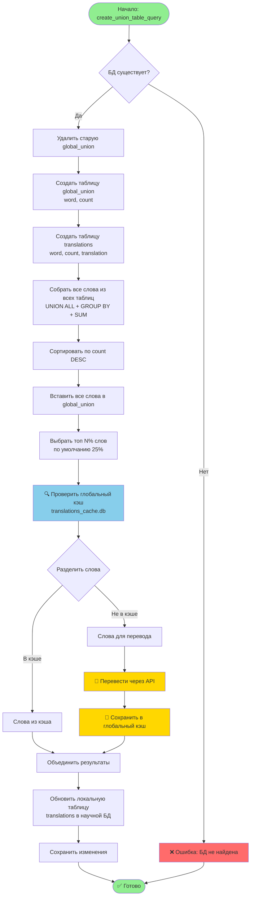
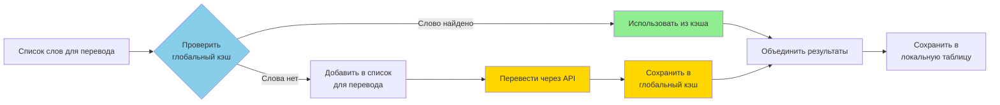
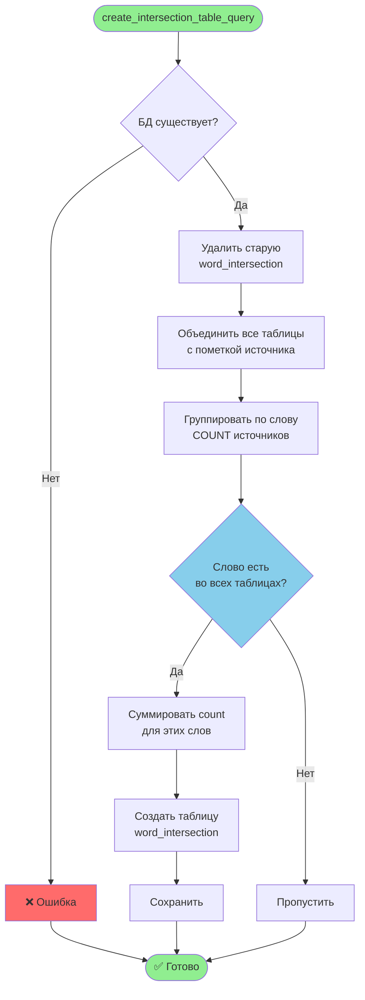
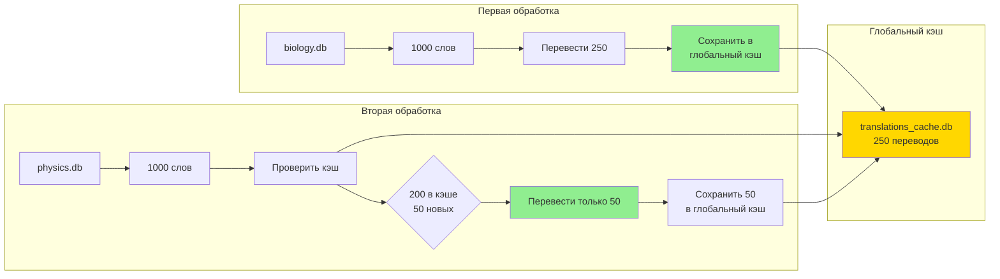
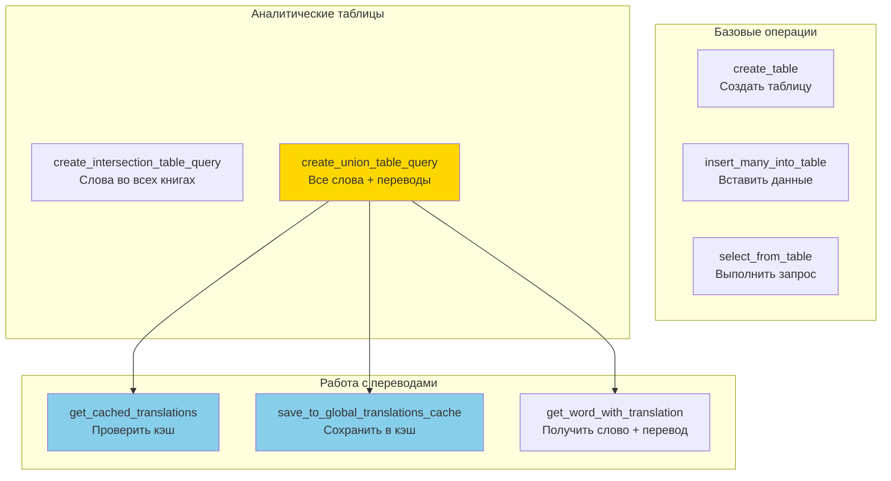

# Блок-схема работы database_operations.py

## 🎯 Основной поток создания global_union с переводами



---

## 🔄 Детальная схема работы с кэшем



---

## 📊 Схема создания таблицы пересечения



---

## 💾 Схема работы с глобальным кэшем

```mermaid
flowchart TD
    Start([Запрос переводов]) --> Init{Кэш существует?}
    Init -->|Нет| CreateCache[Создать translations_cache.db<br/>и таблицу]
    Init -->|Да| QueryCache
    CreateCache --> QueryCache[Запрос: SELECT word, translation<br/>WHERE word IN ...]
    
    QueryCache --> Return[Вернуть словарь<br/>{word: translation}]
    Return --> End([✅ Готово])
    
    SaveStart([Сохранение переводов]) --> Init2{Кэш существует?}
    Init2 -->|Нет| CreateCache2[Создать кэш]
    Init2 -->|Да| Insert
    CreateCache2 --> Insert[INSERT OR IGNORE<br/>в translations_cache]
    Insert --> End2([✅ Готово])
    
    style Start fill:#90EE90
    style End fill:#90EE90
    style SaveStart fill:#90EE90
    style End2 fill:#90EE90
    style QueryCache fill:#87CEEB
    style Insert fill:#FFD700
```

---

## 🔀 Схема работы между разными научными БД



---

## 📝 Упрощённая схема основных функций



---

## 🎓 Легенда блок-схем

- 🟢 **Зелёный** — начало/конец, успешное завершение
- 🔵 **Голубой** — проверки, условия
- 🟡 **Жёлтый** — операции с переводами, API
- 🔴 **Красный** — ошибки

---

## 📌 Ключевые моменты

1. **Глобальный кэш** используется всеми научными БД
2. **Локальная таблица** содержит переводы только для этой науки
3. **Переводятся только топ N%** слов (экономия токенов)
4. **Кэш сохраняется** между запусками программы

